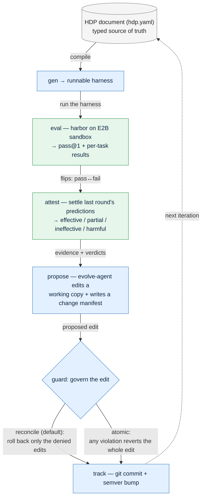

# HDP — Harness Definition Protocol & Engine


> A typed, version-controlled, **governed** way to evolve a coding agent's *harness*
> (prompts, tools, middleware, memory, …) — built on top of the AHE evolve→analyze→improve loop.

The base LLM is fixed. What changes is the **harness** around it, described as a single typed
document (`hdp.yaml`) and edited under a safety **guard** so an automated agent can improve the
harness without ever loosening its own permissions.

---

## What this does, in one picture



One iteration = **gen → eval → attest → propose → guard → track**, all over the HDP document.

- The **source document is never mutated** — only a working copy is edited.
- `guard` is the agent's **only write path**; an edit can never widen its own permissions.
- Blue = steps that touch the document; green = measurement; the dashed arrow closes the loop into the next iteration.

---

## Prerequisites

- **Python ≥ 3.13**
- **[uv](https://github.com/astral-sh/uv)** (package manager)
- **tmux** (used by the underlying AHE harness runner)
- For **real** evaluations only: an LLM endpoint + an [E2B](https://e2b.dev) key (see `.env` below).
  Everything else runs **for $0**.

---

## Setup (once)

```bash
# 1. install dependencies
uv sync

# 2. create your .env (real runs only — dry-run/tests need nothing here)
cat > .env <<'EOF'
LLM_API_KEY=sk-...           # your model API key
LLM_BASE_URL=https://.../v1/ # OpenAI-compatible base URL
E2B_API_KEY=e2b_...          # sandbox provider key
EOF
```

That's it. The next section runs **without** any keys.

---

## Quick start — the $0 paths (start here)

Run these in order; none of them spends money or touches the network.

```bash
# 1. run the test suite (fast, deterministic) — expect "71 passed"
uv run python -m pytest hdp/engine/tests -q

# 1b. lint + type-check the HDP package (both clean)
uv run ruff check hdp/ ahe_control/
uv run mypy hdp

# 2. end-to-end wiring check on a tiny slice → prints a 2-arm A/B table with fake numbers
./scripts/hdp.sh smoke --dry-run

# 3. compile the HDP document into a runnable NexAU harness
./scripts/hdp.sh gen

# 4. recover an HDP document from an existing harness (the reverse of gen)
./scripts/hdp.sh lift
```

If all four work, your install is healthy. **`smoke --dry-run` is the canonical "does it all
wire up?" check.**

> 💡 The guard's command-line tool also works standalone:
> ```bash
> python -m hdp.engine.guard <doc.hdp> --edit edit.json          # decide only (no changes)
> python -m hdp.engine.guard <doc.hdp> --edit edit.json --apply  # enforce atomically
> ```

---

## Running a real evaluation (spends money)

Real Terminal-Bench-2 runs go through the **`evolve`** sub-command — **not** `bench`
(see gaps below). Start small with the smoke caps.

1. Edit `configs/hdp/master.yaml` → set the smoke slice and turn the real eval on:
   ```yaml
   run:
     smoke: { enabled: true, max_tasks: 5, max_iterations: 1, k: 1, dry_run: false }
   ```
2. Run it:
   ```bash
   ./scripts/hdp.sh evolve --config configs/hdp/master.yaml
   ```

This launches the **real** evolve-agent (LLM) and a **real** harbor rollout on E2B over a 5-task
slice, then governs the proposed edit and records it.

> ⚠️ **Money / gotchas**
> - `evolve --dry-run` fakes only the *eval reward* — the proposer is still the real LLM agent, so it is **not** free.
> - `bench` and `smoke` **without** `--dry-run` deliberately raise `NotImplementedError` ("real harbor eval lands in Phase 5"). **Real evals only go through `evolve`.**

### Guard ablation (the built-in study)

The loop can govern edits with **either** of two engines, switched by one config key:

```yaml
hdp:
  guard:
    engine: reconcile   # per-delta rollback (soft) — DEFAULT
    # engine: atomic    # all-or-nothing tiered hard-block (strict) + review mode
    mode: enforce       # enforce | review   (atomic engine only)
```

Run `evolve` once with each value to compare soft per-delta reconciliation vs strict
transactional enforcement.

---

## Configuration

You only ever edit **`configs/hdp/master.yaml`**. It inherits the repo's base config
(`_base: ../base.yaml`) and adds two blocks:

| Key | Meaning |
|---|---|
| `hdp.document` | the source-of-truth HDP doc fed to `gen` |
| `hdp.harness` | the backend harness fed to `lift` |
| `hdp.target` | backend generator/lifter (`nexau`) |
| `hdp.guard.engine` / `.mode` | which guard governs edits (see ablation above) |
| `run.arm` / `run.seed` | run identity |
| `run.smoke.*` | tiny-slice + `dry_run` switches for cheap/free runs |

---

## Repository layout

HDP (the protocol + engine) is the main package. The original AHE control loop lives in its own
`ahe_control/` package so it can be run on demand as the A/B **control** arm; the HDP engine reaches
into it only at four narrow seams (`from ahe_control.evolve import …`) — a clean one-way edge.

```
hdp/                       ← THE protocol + engine (the heavy part of the repo)
  SPEC.md                  the protocol (ETCLOVG layers, operators, manifests, safety rules)
  schema/                  JSON Schemas (source of truth for the typed model)
  validator/               reference validator (the policy the guard reuses)
  examples/                a worked HDP document (the AHE seed agent)
  engine/
    core/                  typed model, loader, component differ
    adapters/              FrameworkAdapter seam + nexau adapter (+ verbatim seed assets)
    gen/  lift/            document ⇄ harness
    guard/                 the edit gateway — two engines (see below)
    track/  attest/        version control + verdict reconciliation
    loop.py propose.py eval.py bench/      the evolve loop + A/B
    run.py                 master entry point (lift|gen|evolve|bench|smoke)
  STATUS.md                live implementation status

ahe_control/               ← AHE control loop, run on demand (the A/B control arm)
  evolve.py                the evolve→eval→improve orchestrator (harbor + ADB)
  trace_converter.py       trace normalization

agents/                    shared NexAU agents (code_agent_simple, evolve_agent, explore_agent)
configs/                   shared configs (base.yaml + experiments/ + hdp/)
scripts/hdp.sh             thin wrapper around hdp/engine/run.py
```

### Running the AHE control baseline

The HDP treatment loop runs via `./scripts/hdp.sh evolve …`. To run the **control** arm (plain AHE
editing the NexAU files directly) on the same task/iters:

```bash
uv run python -m ahe_control.evolve --config configs/experiments/exp-control-overfull.yaml
```

### The two guard engines

| | `reconcile` (default) | `atomic` |
|---|---|---|
| Policy on a bad edit | roll back **only the denied** component deltas, keep the rest | revert the **whole** edit |
| Checks | protected / read_only / editable / manifest | + confinement, secrets, blast-radius, model-config, structural; + `review` mode + audit trail |
| Use | soft, partial | strict, transactional |

Both are exposed through `guard.govern(old, new, manifest, engine=...)`.

---

## Current status & known gaps

Phases 0–5 are implemented and the **dry-run / test paths are fully green** (71 tests pass,
`ruff` + `mypy hdp` clean, smoke produces the 2-arm table). The following are **not yet complete** —
none of them crashes the `evolve` path, but they limit what you can claim:

1. **Phase 4 — auto-rollback missing.** `attest` can label a regressive edit `harmful`, but there
   is no `track.rollback()` and the loop does not auto-revert it. The version-history *query* API
   (history-per-component, harness-at-iter-N, diff) is also not built.
2. **Phase 5 — `bench` is a stub.** `bench` currently just prints the 2-arm *smoke* table; a real
   treatment-vs-control campaign runner (multi-seed, real quality/cost metrics) is not wired.
   `hdp.enabled` is also not yet added to `configs/base.yaml` for the live control arm.
3. **Real benchmark results are spend-gated and unproven.** Phase 1's score-match
   (generated harness ≈ 62.9% on Terminal-Bench 2) and the Phase 5 live A/B campaign have only
   been exercised via dry-run / unit tests. The first real `evolve` run may hit integration
   rough edges.
4. **`reconcile` is the *softer* guard.** It rolls back manifest entries but **not** embedded file
   *content*, and does not check `base_model` / secrets / blast-radius. The `atomic` engine covers
   all of these. Choose accordingly (see the ablation table).

See **`hdp/STATUS.md`** for the authoritative, up-to-date status.

---

<sub><sup>Built on top of <b>AHE — Agentic Harness Engineering</b> (the original evolve→analyze→improve loop, NexAU framework, harbor eval, and Terminal-Bench setup), whose codebase this engine extends. All credit for that foundation belongs to the AHE authors; the HDP protocol and engine layered here reuse it rather than replace it. The original AHE README is preserved at <a href="README_zh.md">README_zh.md</a> (Chinese) and in git history.</sup></sub>
